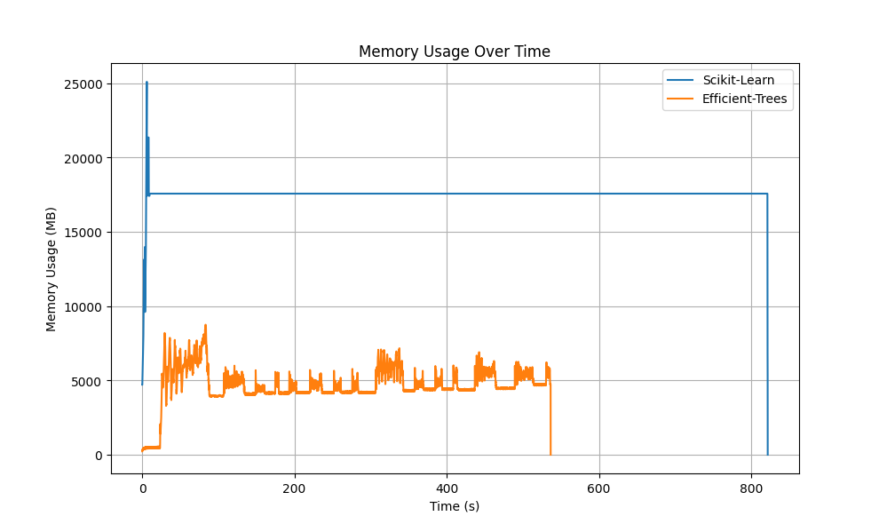

# Efficient-Trees

**Efficient-Trees** is a memory-optimized Python library for building decision trees and tree-based models, designed to handle large-scale datasets efficiently without requiring all the data to be loaded into memory. Powered by the high-performance **Polars** backend, it offers significantly faster training times and reduced memory consumption compared to traditional libraries like scikit-learn.

## Features

- **Memory Efficiency**: Processes large datasets without storing all data in memory.
- **Fast Training**: Outperforms scikit-learn in terms of training time and memory consumption.
- **Lightweight Design**: Focused on core tree functionality with minimal dependencies.
- **Customizable**: Built to extend for more advanced tree-based models in the future.

## Installation

Installing efficient-trees locally:

```bash
git clone https://github.com/yourusername/efficient-trees.git
cd efficient-trees
poetry install
```

## Documentation

### Basic usage

```python
import polars as pl
from efficient_trees.tree import DecisionTreeClassifier

X = pl.scan_parquet("file.parquet")
X_test = pl.scan_parquet("test_file.parquet")

# Create and fit a decision tree
tree = DecisionTreeClassifier(max_depth=3)
tree.fit(X, target_name="target")

# Predict using the trained tree
predictions = tree.predict_many(X_test)
print(predictions)
```

## Memory Usage Comparison

The following plot demonstrates the memory usage of different frameworks over time when training a decision tree on a kaggle dataset. 

### Frameworks Compared
1. **Efficient-Trees**: Our implementation using a Polars backend.
2. **Scikit-Learn**: The standard decision tree implementation from scikit-learn.



### Key Observations
1. **Memory Usage**:
   - **Efficient-Trees**: Consumes significantly less memory throughout the training process, showcasing its memory-efficient design. The flat memory profile indicates stable memory usage over time.
   - **Scikit-Learn**: Shows a higher peak memory usage compared to Efficient-Trees. The spikes correspond to memory allocation during data loading.

2. **Runtime**:
   - **Efficient-Trees**: Achieves faster runtime due to the use of a multi-threaded backend powered by Polars. This allows it to leverage multiple CPU cores for parallel computation.
   - **Scikit-Learn**: Has a noticeably longer runtime, likely because it uses a single-threaded implementation for decision tree training.

This comparison highlights the efficiency of the **Efficient-Trees** implementation in terms of both memory consumption and runtime, making it suitable for large-scale datasets or memory-constrained environments.
