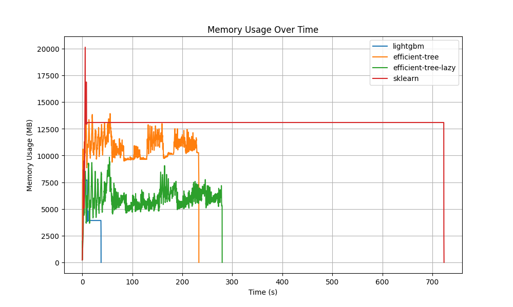

# Efficient-Trees

**Efficient-Trees** is a memory-optimized Python library for building decision trees and tree-based models, designed to handle large-scale datasets efficiently without requiring all the data to be loaded into memory. Powered by the high-performance **Polars** backend, it offers significantly faster training times and reduced memory consumption compared to traditional libraries like scikit-learn.

## Features

- **Memory Efficiency**: Processes large datasets without storing all data in memory.
- **Fast Training**: Outperforms scikit-learn in terms of training time and memory consumption.
- **Lightweight Design**: Focused on core tree functionality with minimal dependencies.
- **Customizable**: Built to extend for more advanced tree-based models in the future.

## Installation

Installing efficient-trees locally:

```bash
git clone https://github.com/yourusername/efficient-trees.git
cd efficient-trees
poetry install
```

## Documentation

### Basic usage

```python
import polars as pl
from efficient_trees.tree import DecisionTreeClassifier

X = pl.scan_parquet("file.parquet")
X_test = pl.scan_parquet("test_file.parquet")

# Create and fit a decision tree
tree = DecisionTreeClassifier(max_depth=3)
tree.fit(X, target_name="target")

# Predict using the trained tree
predictions = tree.predict_many(X_test)
print(predictions)
```

## Memory Usage Comparison

The following plot demonstrates the memory usage of different frameworks over time when training a decision tree on a kaggle dataset. 

### Frameworks Compared
1. **Efficient-Trees**: Our implementation using a Polars backend.
2. **Scikit-Learn**: The standard decision tree implementation from scikit-learn.



### Key Observations

1. **Memory Usage**:
   - **Efficient-Trees (Lazy Execution)**: Uses the least memory among all tested approaches, with a peak memory usage of approximately 8 GB. The lazy execution model efficiently processes data without fully loading it into memory, making it ideal for large-scale or memory-constrained scenarios.
   - **Efficient-Trees (Non-Lazy Execution)**: Requires slightly more memory than the lazy execution variant, with a peak usage of around 12 GB. However, it still outperforms Scikit-Learn and LightGBM in terms of memory efficiency.
   - **Scikit-Learn**: Peaks at about 20 GB of memory, which is significantly higher than Efficient-Trees in both lazy and non-lazy execution modes. The memory profile shows spikes during data loading and model fitting.
   - **LightGBM**: The least memory-efficient approach, requiring approximately 50 GB of memory. Its high memory consumption makes it less suitable for memory-constrained environments.

2. **Runtime**:
   - **LightGBM**: The fastest algorithm overall, leveraging highly optimized code for gradient boosting. However, its speed comes at the cost of significantly higher memory usage.
   - **Efficient-Trees (Non-Lazy Execution)**: The second fastest approach, benefiting from a multi-threaded backend powered by Polars. It strikes a balance between speed and memory usage, outperforming Scikit-Learn and the lazy execution variant.
   - **Efficient-Trees (Lazy Execution)**: The third fastest approach, slightly slower than the non-lazy execution mode due to the overhead of lazy evaluation. However, its reduced memory usage makes it highly suitable for large datasets.
   - **Scikit-Learn**: By far the slowest algorithm, with a runtime much longer than the other approaches. This is likely due to its single-threaded implementation, which cannot leverage modern multi-core processors effectively.

3. **Overall Insights**:
   - **Efficient-Trees** demonstrates superior memory efficiency, particularly in the lazy execution mode, making it a strong choice for applications where memory constraints are a concern.
   - While **LightGBM** is very good in speed, its high memory usage limits its applicability in low-memory environments.
   - **Scikit-Learn**, while a well-established library, shows significant limitations in both speed and memory efficiency compared to the other approaches.

This comparison shows the capabilities of **Efficient-Trees**, which provides a range of execution modes to optimize for different trade-offs between speed and memory usage. Its lazy execution mode is particularly valuable for large-scale datasets, while the non-lazy mode balances performance and resource consumption.
